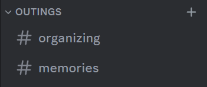

## Discord server bot

Bot to help manage my server with friends

### Dev environment

#### Architecture

The way local development will work is we'll run the FE and BE independently, then use `docker-compose.yml` to run our
DB and nginx proxy.

The nginx proxy is used to simplify CORS requests so that we don't have to deal with that stuff when developing locally.

#### Startup

Create a file at `backend/src/main/resources/application-local.yaml`, with the contents below

Both the `spring.security.oauth2` (OAuth2 tab) and `dev.tylercash.discord.token` (Bot tab) can be retrieved from
the [Discord Developer Portal](https://discord.com/developers/applications).

The guild ID can be retrieved from your discord client by right clicking a server and selecting "Copy server ID"

```yaml
dev.tylercash:
  discord:
    token: ""
    guild-id: 0

spring:
  security:
    oauth2:
      client:
        registration:
          discord:
            client-id: ""
            client-secret: ""
```

In IntelliJ I've provided a Docker 'Run All' run configuration which will start everything up

#### Setup Discord server

Create a category in the server called "outings"

Create a channel in the category (Default `memories`)



### Access components

You can access the frontend at http://localhost:8000/

You can access the backend docs at http://localhost:8000/api/swagger-ui.html

You can access the DB at localhost:5432