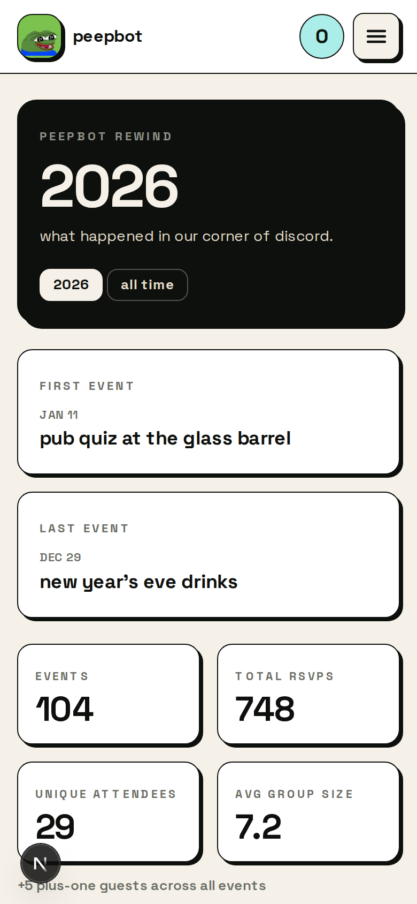

# Peep Bot

Try it out at https://event.tylercash.dev

**Plans, sorted.** Peep Bot is the event planner for friend groups that already live in Discord. Drop a plan into the
web app, and it shows up in your server as a real Discord event with RSVPs, reminders, and a tidy thread for the
chatter — no more "wait, are we still doing this?" in five different DMs.

<p align="center">
  
  
  
</p>

## What it does

- **One feed for what's happening.** A scrollable, mobile-friendly view of every upcoming plan in your server —
  organiser, time, location, who's in.
- **Web login via Discord.** OAuth2 in, sessions persisted, no extra accounts to manage.

## How it fits together

| Piece          | Stack                                                                  |
|----------------|------------------------------------------------------------------------|
| Backend        | Spring Boot 3.5 · Java 21 · JDA 5 · PostgreSQL · Liquibase · Resilience4j |
| Frontend       | Next.js 15 (App Router) · React 19 · Tailwind · SWR · MSW for mocks    |
| Auth           | Spring Security + Discord OAuth2, JDBC sessions                        |
| Deploy         | Backend image at `ghcr.io/tyler-cash/peep-bot-backend`                 |

The frontend ships with an in-browser MSW backend so the entire UI is usable (and screenshotable) without running
the Java backend, Postgres, or any Discord secrets.

## Try the UI in 30 seconds

```bash
cd frontend
npm install
npm run dev
```

Open <http://localhost:3000> — you'll be auto-logged-in as a mock user against a fake server with seeded events,
RSVPs, and a year of fixture data for Rewind.

## Run the full stack locally

### Prerequisites

- **Java 21**
- **Node.js 20+**
- **Docker** (for PostgreSQL)

### 1. Start the database

```bash
docker-compose up -d
```

Postgres 17 on port 5432, credentials `peepbot/peepbot`, database `peepbot`.

### 2. Configure secrets

Create `backend/src/main/resources/application-local.yaml` (gitignored):

```yaml
dev.tylercash:
  discord:
    token: "<discord-bot-token>"
  cors:
    allowed-origins: http://localhost:3000

spring:
  datasource:
    url: jdbc:postgresql://localhost:5432/peepbot
    username: peepbot
    password: peepbot
  security:
    oauth2:
      client:
        registration:
          discord:
            client-id: "<oauth2-client-id>"
            client-secret: "<oauth2-client-secret>"
  devtools:
    restart:
      enabled: false
  session:
    cookie:
      secure: false

server:
  servlet:
    session:
      cookie:
        secure: false
```

The bot token and OAuth2 credentials come from the
[Discord Developer Portal](https://discord.com/developers/applications). Want to skip the OAuth dance entirely while
hacking? See the dev auto-login section in [`CLAUDE.md`](CLAUDE.md).

### 3. Start the backend

```bash
cd backend
./gradlew bootRun "--args=--spring.profiles.active=local,nonprod"
```

Backend runs at `http://localhost:8080/api/`. Swagger UI: `http://localhost:8080/api/swagger-ui.html`.

### 4. Start the frontend against the live backend

```bash
cd frontend
NEXT_PUBLIC_API_MODE=live npm run dev
```

Without `NEXT_PUBLIC_API_MODE=live` the frontend stays in mock mode.

### 5. Add Peep Bot to a server

Log in at <http://localhost:3000/login>. If the bot isn't in any of your servers yet, the UI walks you through the
install. The backend creates the required Discord categories (`outings`, `outings-archive`) and the `organising`
separator channel on first join.

## Seeding test data

```bash
./scripts/seed-events.sh http://localhost:8080/api "<your-SESSION-cookie>"
```

The script creates five sample events (hikes, movie nights, BBQs, trivia, laser tag). Grab the `SESSION` cookie from
DevTools → Application → Cookies after you log in.

## Common commands

### Backend

```bash
./gradlew test              # Unit tests
./gradlew e2eTest           # Integration / Testcontainers
./gradlew spotlessCheck     # Formatting
./gradlew spotlessApply     # Auto-format
./gradlew bootJar           # Executable jar
./gradlew bootBuildImage    # Docker image
```

### Frontend

```bash
npm run dev          # Dev server (mock mode by default)
npm run build        # Production build
npm run typecheck    # TypeScript --noEmit
npm run lint         # ESLint
npm run test         # Vitest unit + API route tests
npm run test:e2e     # Playwright smoke suite (against MSW)
```