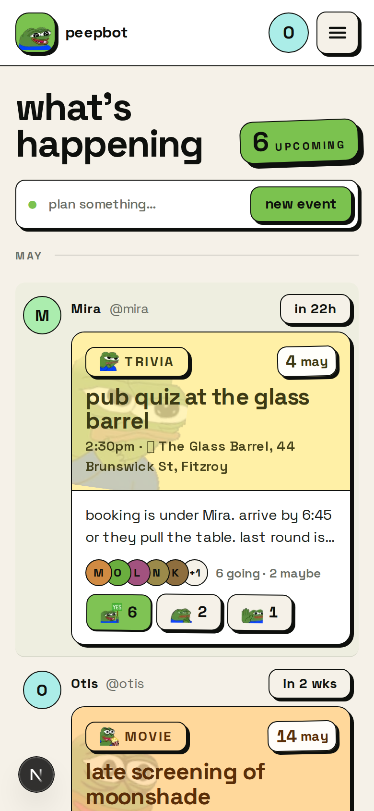
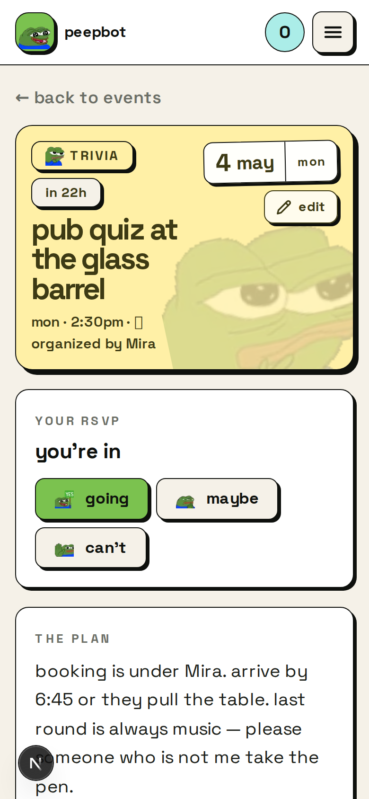
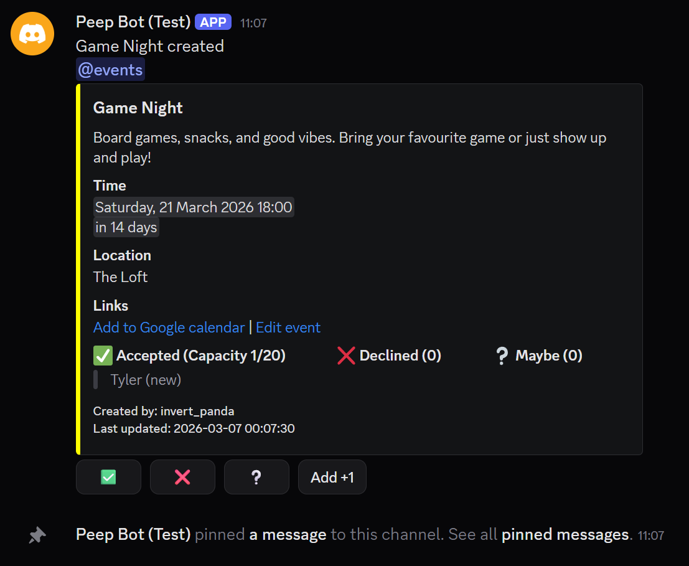
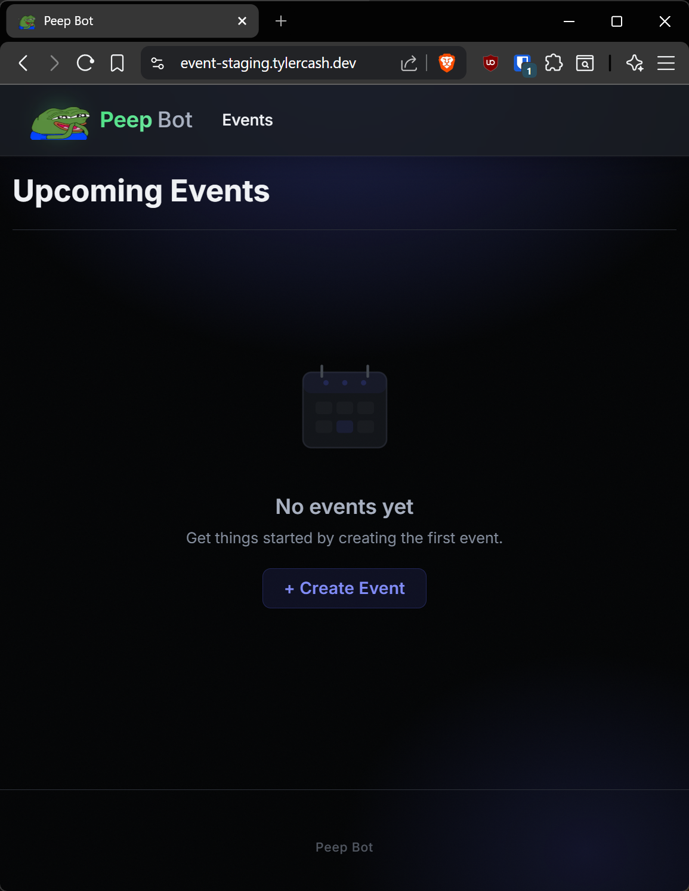

# Peep Bot

A Discord-integrated event management app. Create and manage events through a web UI, with automatic posting and RSVP tracking in your Discord server.





## Getting Started

### Prerequisites

- **Java 21**
- **Node.js 20.19+ or 22.12+**
- **Docker** (for PostgreSQL)

### 1. Start the database

```bash
docker-compose up -d
```

### 2. Configure secrets

Create `backend/src/main/resources/application-local.yaml` (gitignored):

```yaml
dev.tylercash:
  discord:
    token: "<discord-bot-token>"
    guild-id: <discord-guild-id>
  cors:
    allowed-origins: http://localhost:5173

spring:
  datasource:
    url: jdbc:postgresql://localhost:5432/peepbot
    username: peepbot
    password: peepbot
  security:
    oauth2:
      client:
        registration:
          discord:
            client-id: "<oauth2-client-id>"
            client-secret: "<oauth2-client-secret>"
  devtools:
    restart:
      enabled: false
  session:
    cookie:
      secure: false

server:
  servlet:
    session:
      cookie:
        secure: false
```

The OAuth2 credentials and bot token are found in the [Discord Developer Portal](https://discord.com/developers/applications). The guild ID can be copied by right-clicking your server in Discord and selecting "Copy Server ID".

### 3. Start the backend

```bash
cd backend
./gradlew bootRun "--args=--spring.profiles.active=local"
```

The backend starts on `http://localhost:8080/api/`. Swagger UI is available at `http://localhost:8080/api/swagger-ui.html`.

### 4. Start the frontend

```bash
cd frontend
npm install
npm run dev
```

The frontend starts on `http://localhost:5173`. Log in at `http://localhost:5173/login`.



The backend automatically creates the required Discord categories (`outings`, `outings-archive`) and the `organising` separator channel on startup if they don't already exist.

## Seeding Test Data

A script is provided to populate a running instance with sample events:

```bash
./scripts/seed-events.sh <base-url> <session-cookie>
```

For example, against a local instance:

```bash
./scripts/seed-events.sh http://localhost:8080/api "your-session-cookie-value"
```

To get your `SESSION` cookie:
1. Log in via the frontend
2. Open browser DevTools → Application → Cookies
3. Copy the value of the `SESSION` cookie

The script creates five sample events (hikes, movie nights, BBQs, trivia, laser tag) and requires `curl` and `jq`.

## Common Commands

### Backend

```bash
./gradlew test              # Run tests
./gradlew e2eTest           # Run end-to-end tests
./gradlew spotlessCheck     # Check formatting
./gradlew spotlessApply     # Auto-fix formatting
./gradlew bootJar           # Build executable jar
./gradlew bootBuildImage    # Build Docker image
```

### Frontend

```bash
npm run dev            # Dev server
npm run build          # Production build
npm run lint           # ESLint check
npm run lint:fix       # ESLint auto-fix
npm run format         # Prettier format
npm run format:check   # Prettier check
```
